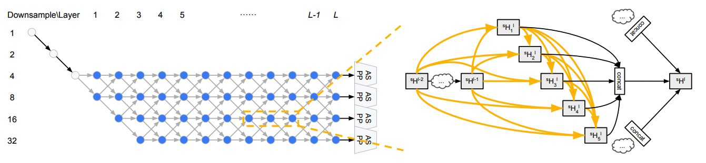

# AutoML for Image Semantic Segmentation :  https://github.com/NoamRosenberg/autodeeplab
This repo is modified for salt marsh data based on the code by NoamRosenberg. 

This repo contains  open-source implementation of [Auto-Deeplab](https://arxiv.org/abs/1901.02985) which **out-performs** that of the original paper. 


Following the popular trend of modern CNN architectures having a two level hierarchy. Auto-Deeplab forms a dual level search space, searching for optimal network and cell architecture.



## Training Proceedure

**All together there are 3 stages:**

1. Architecture Search - Here you will train one large relaxed architecture that is meant to represent many discreet smaller architectures woven together.

2. Decode - Once you've finished the architecture search, load your large relaxed architecture and decode it to find your optimal architecture.

3. Re-train - Once you have a decoded and poses a final description of your optimal model, use it to build and train your new optimal model

<br/><br/>

**Hardware Requirement**

* For architecture search, you need at least an 15G GPU, or two 11G gpus(in this way, global pooling in aspp is banned, not recommended)

* For retraining autodeeplab-M or autodeeplab-S, you need at least n more than 11G gpus to re-train with batch size 2n without distributed

* For retraining autodeeplab-L, you need at least n more than 11G gpus to re-train with batch size 2n with distributed
 
 ## Architecture Search


***Begin Architecture Search***

**Start Training**

```
CUDA_VISIBLE_DEVICES=0 python train_autodeeplab.py --dataset cityscapes
```

**Resume Training**

```
CUDA_VISIBLE_DEVICES=0 python train_autodeeplab.py --dataset cityscapes --resume /AutoDeeplabpath/checkpoint.pth.tar
```

## Re-train

***Now that you're done training the search algorithm, it's time to decode the search space and find your new optimal architecture. 
After that just build your new model and begin training it***


**Load and Decode**
```
CUDA_VISIBLE_DEVICES=0 python decode_autodeeplab.py --dataset cityscapes --resume /AutoDeeplabpath/checkpoint.pth.tar
```

## Retrain

**Train without distributed**
```
python train.py
```

**Train with distributed**
```
CUDA_VISIBLE_DEVICES=0,1,2,···,n python -m torch.distributed.launch --nproc_per_node=n train_distributed.py  
```

## Requirements

* Pytorch version 1.1

* Python 3

* tensorboardX

* torchvision

* pycocotools

* tqdm

* numpy

* pandas

* apex

## References
[0] : [Noam Rosenberg's Autodeeplab implementation](https://github.com/NoamRosenberg/autodeeplab) 
[1] : [Auto-DeepLab: Hierarchical Neural Architecture Search for Semantic Image Segmentation](https://arxiv.org/abs/1901.02985)

[2] : [Thanks for jfzhang's deeplab v3+ implemention of pytorch](https://github.com/jfzhang95/pytorch-deeplab-xception)

[3] : [Thanks for MenghaoGuo's autodeeplab model implemention](https://github.com/MenghaoGuo/AutoDeeplab)

[4] : [Thanks for CoinCheung's deeplab v3+ implemention of pytorch](https://github.com/CoinCheung/DeepLab-v3-plus-cityscapes)

[5] : [Thanks for chenxi's deeplab v3 implemention of pytorch](https://github.com/chenxi116/DeepLabv3.pytorch)

